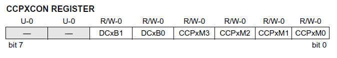

<h1>
{{title}}
</h1>

<h2><i>This reference is still being written and is missing major sections.</i></h2>

It is assumed that the reader is already familiar with traditional Pascal, therefore explanations of Concurrent Pascal fundamentals are omitted in favor of simple examples where Concurrent Pascal and traditional Pascal are similar.  Explanations will only appear where Concurrent Pascal differs from traditional Pascal.

The compiler was designed to support multiple microprocessor architectures by developing separate code generators for each. At the moment the only implementation is for MicroChip's PIC18x microcontrollers, however other microcontroller architectures may be developed in the future. This language reference is intended to describe the language in general without proscribing details of a specific implementation.    Implementations for other microcontrollers may or may not support all the features described here and may provide additional features specific to that microcontroller.  Each implementation should have a User Guide that describes specifics.

# Table of Contents
{:.no_toc}

* TOC
{:toc}

# Comments

~~~
// this is a comment
~~~

Everything from `//` to the end of a line is treated as a comment.  The compiler does not recognize the traditional Pascal in-line `{ comment }` or `(* comment *)`.

# Identifiers

Identifiers are not case sensitive (`ABC` is the same as `abc`).  Identifiers start with either a letter or an underscore and may contain additional letters, digits or underscores.

~~~
abc
abc_def
AbcDef
_abc123
~~~

# Constants

~~~
const
   a = 1;           // an integer
   b = 1_000_000;   // underscores can be inserted for readability 
                    //    but are ignored by the compiler
   c = $1BCD;       // a hex constant
   d = 1.2;         // real numbers
   e = -3.4e7;
   f = 'c';         // a single char
   lf = #10;        // a linefeed char
   g = 'a string';  // a string
~~~

## Constant Expressions

The compiler does extensive constant expression evaluation.  Whenever possible the compiler evaluates expressions at compile time rather than at run time in the generated code.

~~~
const
   h = (a+1)*(3*7);      // an integer constant expression
   i = d-(1.2/3.7);      // a real constant expression
   j = g + ' appended';  // a string constant expression
~~~

`+` *can be used in string constant expressions, however* `strappend` *is used for string variables*

# Types

## Ordinal Types and Subranges

`boolean` can be either `true` or `false` 

`char` defines an 8-bit character

There is no "standard" integer, instead there are pre-defined types for both signed and unsigned integer types of various bit sizes:

-   Predefined signed types: `int1` thru `int64`.
-   Predefined unsigned types: `uint1` thru `uint64`

~~~
type
   tSubRange = 1..5;
~~~

The compiler takes advantage of subranges to produce the minimum necessary code to accomplish an operation.  For example, multiplying two int8 variables can be accomplished with a single multiply instruction on a PIC18, however multiplying two int16 variables takes four. 

## Enumerated Types

~~~
type
   tEnum = (a,b,c);
~~~

## String Types

~~~
type
   tString = string [20];
~~~

Strings indexes start at 1.

## Array Types

~~~
type
   tIntArray = array [1..7] of int16;
   tRealArray = array [tSubRange] of real;
   tMultiArray = array  [1..5, 3..7] of char;
~~~

Given a previous declaration of `tSubRange = 1..5;`, tRealArray defines an array of 5 real numbers.

## Record Types

~~~
type
   tRecord =
      record
         i, j: int8;
         r: real
      end;
~~~

Fields of a record type are aligned for easy addressability even if this leaves unused bits in the type.

## Packed Record Types

Although they can also be used for other purposes, the primary purpose of packed records is to provide a means of describing the bits within a hardware register (an `ioreg` variable in Concurrent Pascal).  For example:

would be declared as follows:

~~~
type
   tCCPXCON =
      packed record
         -: uint2;      // unused field
         DCxB: uint2;
         CCPxM: uint4
      end;
~~~

All fields of a packed record type are packed together with each field taking no more bits than necessary.  All bits of the hardware register must be specified including unused fields.  Packed record types may span multiple adjacent hardware registers.

## Overlay Types 

~~~
type
   tOverlay =
      overlay
         r: real;
         i: int16;
         b: array [0..3] of uint8
      end;
~~~

This is similar to a variant record in traditional Pascal or a union in C.  All variants within the overlay occupy the same memory space and the size of an overlay variable is determined by the size of the largest variant.  Writing to one of the variants overwrites all the other variants.  Overlays are usually used for unchecked type conversions but may also be useful to reduce memory usage.

# Structured Constants

## ROM constants

# System Component Types

## Class Types

~~~
type
   tClass =
      class
         const                        
            len = 5;                  // const len is private to tClass
         var
            s: string [len];          // var s is private to tClass 
         procedure a;                 // procedure a is private to tClass 
            begin
            end;
      public
         procedure p (var i: int8);   // procedure p is public and can operate
            begin                     //     on private class variables (e.g. s)
            end;
         property length: uint8;
            set: begin end;
            get: begin end;
      begin                           // initial statement
         s := 'abc' 
      end;
~~~

A class is an encapsulated data structure.  Multiple variables of type `tClass` can be declared in a program.  Users of those variables can only call the public procedures and properites (in this case `p` and `length`).

Everything declared before the public keyword is considered private to the type.  The procedure `a` can only be called by procedure `p` and the initial statement.  The const `len` and the variable `s` are also private.

A property

The initial statement of an instance of a class is only executed once at system initialization.

A class does not provide concurrent access and is therefore only useful within a single process (or rarely in the program initial statement).

## Monitor Types

A monitor is similar to a class but it does support concurrent access.  The declaration is  similar except that the keyword monitor is used.  

~~~
type
   tMonitor =
      monitor
         const                        
            len = 5;                  // const len is private to tClass
         var
            s: string [len];          // var s is private to tClass 
         procedure a;                 // procedure a is private to tClass 
            begin
            end;
      public
         procedure p (var i: int8);   // procedure p is public and can operate
            begin                     //     on private class variables (e.g. s)
            end;
      begin                           // initial statement
         s := 'abc' 
      end;
~~~

## Process Types
 

 

# ErrorCode 

Embedded microcontrollers do not normally operate in an environment conducive to extensive run-time error reporting such as blue screens or crash dumps, so instead Concurrent Pascal provides a rudimentary error reporting capability in the form of an ErrorCode variable that is set when a run-time error occurs.  The ErrorCode variable is used extensively by the compiler and kernel to report run-time errors and can also be used by the programmer to report errors via the assert statement:

~~~
assert (<boolean expression>, 'Error Message')
~~~

The global ErrorCode variable is assigned a unique value for each reportable run-time error.  The Error Message string itself is not embedded anywhere in the Microcontroller’s ROM but is instead saved in a file named <program_name>.err produced with each successful compilation.  The file lists all possible error codes and the associated error messages as well as the location in the source file where the error occurred. 

The first run-time error to occur sets ErrorCode, subsequent run-time errors do not overwrite it.  This prevents a cascade of errors from overwriting the initial error code. Reading the ErrorCode variable clears it, after which the next run-time error can set it again.

Setting ErrorCode does not abort anything - the program continues running.  The idea is to allow the program to limp on long enough to somehow transmit the ErrorCode back to the programmer so that the underlying bug can be fixed before the code is released.  Ideally ErrorCode will never be set in released code.

The ErrorCode variable may be directly read by Concurrent Pascal code for reporting, perhaps via a communications link or displayed in LEDs. 

# Compiler Directives

## Include Files

~~~
{$INCLUDE 'include_file_name.inc'}
~~~

## Compiler Flags

Your compiler may define a set of compiler flags for controlling aspects of code generation.  For example a RANGE_CHECK flag would control whether or not range checking code is emitted.  Compiler flags may be **ON** or **OFF**.  Documentation for your compiler will provide a list of implemented compiler flags and the purpose of each.

The initial value of the flags at the beginning of the program might be set by the build environment.  For example the flags may initially be turned on when compiled for debug and turned off for release.  Consult the documentation for your compiler for details.

The programmer may specify flag settings for specific sections of the program by adding push and pop directives to the source.  The push directive pushes the current value of a flag onto a stack and then turns it on or off.  The pop directive restores the previous value of the flag.

~~~
{$PUSH RANGE_CHECK ON}
// code in this section will have range checking on
{$POP RANGE_CHECK}
~~~
 
The value of flags carry into include files.  If a flag is **ON** before an include directive, the flag will be **ON** at the beginning of the include file.  Include files may also contain their own push and pop directives.

The value of a flag after an include directive is the same as it was before the include directive no matter what changes to the flag were made by the include file.  For example, if a flag is **ON** before the include directive, and the include file turns the flag **OFF**, the flag will revert to **ON** immediately after the include directive: 

~~~
// RANGE_CHECK is ON
{$include 'include_file_that_turns_RANGE_CHECK_off.inc'}
// RANGE CHECK reverts to ON here
~~~

Each source or include file has its own flag stacks.  The compiler automatically empties each flag stack at the end of the file by popping all un-popped flags pushed within that file.  Therefore the compiler does not require that each push flag directive be matched with a subsequent pop within that same file.

Flag stack underflow is not allowed, therefore each pop flag directive must be preceded by push for that same flag within the same file.

# Reserved Words

The following identifiers are reserved in Concurrent Pascal:

~~~
abs
and
array
assert
at
await
begin
case
chr
class
const
continue
cycle
delay
div
do
downto
eeprom
else
empty
end
exitloop
false
for
function
get
high
if
in
init
interrupt
ioreg
loop
low
maxstrlen
mod
monitor
not
of
or
ord
otherwise
overlay
packed
pred
priority
procedure
process
property
public
record
recycle
reloop
repeat
rom
round
set
strappend
string
strlen
strpos
succ
then
to
true
trunc
type
until
var
while
with
~~~
