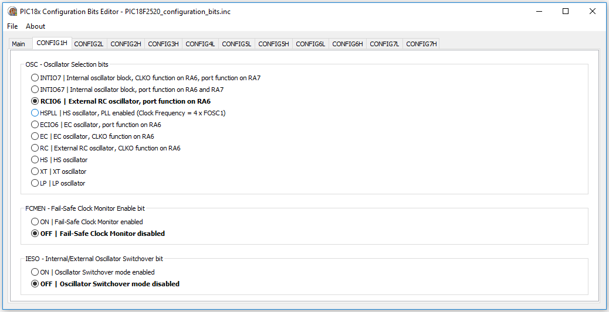
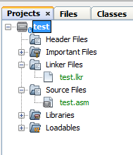
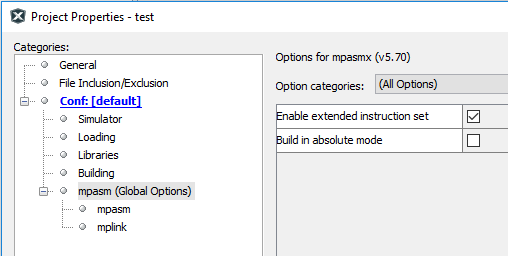
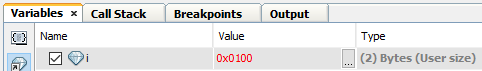
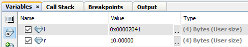
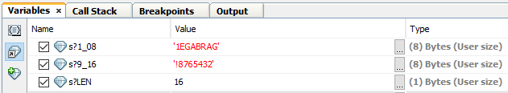
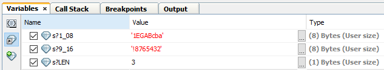
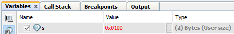
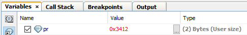

<h1>
{{title}}
</h1>

This document is intended for the user of the Concurrent Pascal compiler for MicroChip's PIC18<b>x</b> line of microcontrollers. Only PIC18 microcontrollers with the e<b>x</b>tended instruction set are supported. The extended instruction set adds support for the stack operations required for  re-entrant code. 

This document assumes the reader is already familiar with:

* Concurrent Pascal introductory material,
* Concurrent Pascal Language Reference,
* The MicroChip Datasheet for your PIC18x microcontroller. 

# Table of Contents
{:.no_toc}

* TOC
{:toc}

# Compiler Output Files

The successful compilation of the primary source file **xxxxx.cp** will produce four output files:

## Assembly Source File

The assembly source file **xxxxx.asm** can be viewed to examine the code emitted by the compiler.  Concurrent Pascal source lines are shown as comments followed by the generated assembly code for that line.  This file also contains annotated code for the custom-generated kernel as well as other routines.  This file can be compiled with MPASM and may be of use in the various MPLABX debuggers.  

Further editing of this file is unlikely to be productive since the compiler has internally calculated various addresses, sizes and offsets and these are not re-calculated or adjusted when the file is modified and re-assembled.

## Binary Hex File

The binary file **xxxxx.hex** contains the executable machine code for the microcontroller. This file is in standard Intel hexadecimal format and can be used with a device programmer to download the program into a microcontroller.

## Run Time Error File

The runtime error file **xxxxx.rterr** is an XML file that contains an entry for each possible  ErrorCode value that can occur in the program.  For each ErrorCode the following information is provided:

* ErrorCode - an integer value in decimal format.
* HexErrorCode - the ErrorCode value in hex format.  The ErrorCode value is derived from the program counter value where the error occurred. For some operations (notably floating point divide) small offsets are added to the PC to allow different errors to be distinguished - this may result in odd values for ErrorCode (unlike the PIC18 PC which is always even). 
* ErrorMessage - the explanation for the run time error.  For assert failures this is the assert message .
* SourceFile - the name of the source file containing the line where the error occurred.  
* LineNo - the line number in the source file where the error occurred (line numbers start at 1).
* Pos - the position on the line where the error occurred (first character is position 1).

Normally the error location is found in the Concurrent Pascal source using the SourceFile and LineNo values for the reported ErrorCode. In some cases you may also want to consult the assembly listing produced when the assembly source file is assembled by MPASM (this has to be done as an extra step - the Concurrent Pascal Compiler does not run MPASM as part of the compilation process).  This listing shows program locations in hex and the error location can be found using the Addr value. 

## Linker Script File

The linker script file **xxxxx.lkr** is used by MPLINK when developing applications in MPLABX.

# Processor Directive

The microcontroller is specified by a compiler directive in the first line in the source file:

~~~
{$processor 'pic18f2520'}
~~~

This directive causes the compiler to reference two files included with the Concurrent Pascal distribution:

* bin/pic18x/include/pic18f2520.inc
* bin/pic18x/processor_definition_files/pic18f2520.xml

The pic18f2520.inc file is a Concurrent Pascal source file that specifies a configuration bits type definition, ioreg type definitions, ioregs, interrupt variables and prototypes for special compiler-implemented procedures for that microprocessor.

The pic18f2520.xml file provides microcontroller specific information for the compiler such as SFR addresses, memory layout and sizes, and so forth.

# Configuration Bits

The include file supplies a type definition for a structured constant for the MicroController’s configuration bits (aka fuses). The structured constant type defines a record containing all configuration bytes for the microcontroller. Below is a partial listing of the type definition  for the PIC18F2520:

~~~
type
   tPIC18F2520_configuration_bits =
      record
         -: uint8;
         CONFIG1H:
            packed record
               IESO:
                  (CONFIG1H_IESO_OFF = 0,
                   CONFIG1H_IESO_ON  = 1
                  );
               FCMEN:
                  (CONFIG1H_FCMEN_OFF = 0,
                   CONFIG1H_FCMEN_ON  = 1
                  );
               -: uint2;
               OSC:
                  (CONFIG1H_OSC_LP      = $0,
                   CONFIG1H_OSC_XT      = $1,
                   CONFIG1H_OSC_HS      = $2,
                   CONFIG1H_OSC_RC      = $3,
                   CONFIG1H_OSC_EC      = $4,
                   CONFIG1H_OSC_ECIO6   = $5,
                   CONFIG1H_OSC_HSPLL   = $6,
                   CONFIG1H_OSC_RCIO6   = $7,
                   CONFIG1H_OSC_INTIO67 = $8,
                   CONFIG1H_OSC_INTIO7  = $9
                  ) 
            end;
         CONFIG2L:
            packed record
               BORV:
                  (CONFIG2L_BORV_0 = 0,
                   CONFIG2L_BORV_1 = 1,
                   CONFIG2L_BORV_2 = 2,
                   CONFIG2L_BORV_3 = 3
                  );
               BOREN:
                  (CONFIG2L_BOREN_OFF     = 0,
                   CONFIG2L_BOREN_ON      = 1,
                   CONFIG2L_BOREN_NOSLP   = 2,
                   CONFIG2L_BOREN_SBORDIS = 3
                  );
               PWRT:
                  (CONFIG2L_PWRT_ON  = 0,
                   CONFIG2L_PWRT_OFF = 1
                  ) 
            end;
         ...
~~~

Your program will normally contain a structured constant specifying the desired configuration bits. Any program containing an appropriately named structured constant will include the configuration bits in the binary files produced by the compiler. This constant <b>must</b> be named xxxx_configuration_bits where xxxx is the PIC18 microcontroller specified in the compiler directive at the beginning of the program.  For example:

~~~
const
   PIC18F2520_configuration_bits: tPIC18F2520_configuration_bits =
      (CONFIG1H =
          (IESO = CONFIG1H_IESO_OFF,
              // Internal/External Oscillator Switchover bit:
              //    OFF = Oscillator Switchover mode disabled
           FCMEN = CONFIG1H_FCMEN_OFF,
              // Fail-Safe Clock Monitor Enable bit:
              //    OFF = Fail-Safe Clock Monitor disabled
           OSC = CONFIG1H_OSC_RCIO6
              // Oscillator Selection bits:
              //    RCIO6 = External RC oscillator, port function on RA6
          ),
       CONFIG2L =
          (BORV = CONFIG2L_BORV_3,
              // Brown Out Reset Voltage bits:
              //    3 = Minimum setting
           BOREN = CONFIG2L_BOREN_SBORDIS,
              // Brown-out Reset Enable bits:
              //    SBORDIS = Brown-out Reset enabled in hardware only (SBOREN is disabled)
           PWRT = CONFIG2L_PWRT_OFF
              // Power-up Timer Enable bit:
              //    OFF = PWRT disabled
          ),
       ...
~~~ 

## Configuration Bits Editor

The Configuration Bits Editor (pic18x_config_bit_editor.exe) is used to easily construct a custom configuration bits constant for a project. This constant is typically saved in its own include file in the project directory and included into the main source file:  

~~~
{$processor 'pic18f2520'}
{$include 'pic18f2520_config_bits.inc'}
...
~~~

The desired micro-controller is selected when a new include file is first created.  The initial version of the constant with standard default values appears in the Main tab.  There is a tab for each configuration byte of the microcontroller and individual fields are set using radio buttons.

{:hspace="50"}

For each field the default value is shown in bold font.  

Switching back to the Main tab shows the current value of the constant.

Once the configuration constant is fully specified it should be saved to the project source directory.  This file can be re-opened in the editor at a later time if modifications are necessary.

# General Purpose Registers (GPRs) 

GPRs are used as RAM and locations are assigned by the compiler for variables, system types, stacks and internal kernel data structures.

## Non-Contiguous GPR Regions

A few PIC18s have non-contiguous GPR regions.  The current implementation of the compiler only utilizes the first GPR region.

## Dual-Port GPRs

Some PIC18x microcontrollers (e.g. USB controllers) have dual-ported GPRs.  This is not currently supported.

# Special Function Registers (SFRs)

The microprocessor include file referenced by the $processor directive contains type definitions for the SFRs.  

For example, the datasheet for the PIC18F2525 describes the BAUDCON SFR bits as follows:

{:hspace="50"}

The pic18f2525.inc include file supplies the following type definition and ioreg declaration for BAUDCON:

~~~
type
   tBAUDCON =
      overlay
         packed record
            ABDOVF: uint1;
            RCIDL: uint1;
            RXDTP: uint1;
            TXCKP: uint1;
            BRG16: uint1;
            -: uint1;
            WUE: uint1;
            ABDEN: uint1
         end;
         packed record
            -: uint1;
            RCMT: uint1;
            RXCKP: uint1;
            SCKP: uint1;
            -: uint4
         end
      end;

ioreg
   BAUDCON: tBAUDCON at $FB8;
~~~

In addition to the fields defined by the datasheet, there are also occassionally some additional overlaid fields taken from Microchip documentation such as the RCMT, RXCKP and SCKP fields above.  These may or may not be useful.  Sometimes they are alternate field names used in earlier PIC microcontrollers that may be helpful when studying source code examples in C or assembler.

## Combo SFR types

Often there are two or more adjacent SFRs for a hardware module that can be combined to form a single multi-byte ioreg variable - this is specified by a "combo SFR" type definition.  

An example would be the Analog to Digital Converter (ADC) in the PIC18F2520.  AD: tAD combines five SFRs into a single variable:

* A/D Result High Register (ADRESH)
* A/D Result Low Register (ADRESL)
* A/D Control Register 0 (ADCON0)
* A/D Control Register 1 (ADCON1)
* A/D Control Register 2 (ADCON2)

~~~
type
   tAD =
      overlay
         packed record
            ADRES: uint16;
            -: uint2;
            CHS: uint4;
            GO_nDONE: uint1;
            ADON: uint1;
            -: uint2;
            VCFG: uint2;
            PCFG: uint4;
            ADFM: uint1;
            -: uint1;
            ACQT: uint3;
            ADCS: uint3
         end;
         packed record
            -: uint4;
            ADRES_12R: uint12;
            -: uint2;
            CHS3: uint1;
            CHS2: uint1;
            CHS1: uint1;
            CHS0: uint1;
            GO: uint1;
            -: uint3;
            VCFG1: uint1;
            VCFG0: uint1;
            PCFG3: uint1;
            PCFG2: uint1;
            PCFG1: uint1;
            PCFG0: uint1;
            -: uint2;
            ACQT2: uint1;
            ACQT1: uint1;
            ACQT0: uint1;
            ADCS2: uint1;
            ADCS1: uint1;
            ADCS0: uint1
         end;
         packed record
            ADRES_8L: uint8;
            ADRES_8R: uint8;
            -: uint6;
            DONE: uint1;
            -: uint17
         end;
         packed record
            ADRES_10L: uint10;
            -: uint12;
            nDONE: uint1;
            -: uint17
         end;
         packed record
            -: uint6;
            ADRES_10R: uint10;
            -: uint6;
            GO_DONE: uint1;
            -: uint17
         end;
         packed record
            ADRES_12L: uint12;
            -: uint28
         end;
         packed record
            ADRESH: uint8;
            ADRESL: uint8;
            -: uint24
         end
      end;

ioreg
   AD: tAD at $FC0;
~~~

### Special AD Result Fields

In addition to ADRES, ADRESH and ADRESL, the following special fields are defined for the analog to digital converter:

~~~
   ADRES_8L: uint8;
   ADRES_8R: uint8;
   ADRES_10L: uint10;
   ADRES_10R: uint10;
   ADRES_12L: uint12;
   ADRES_12R: uint12;
~~~

Each of these fields provides access to the exact bits of a particular configurable ADC result.  Depending on the microcontroller, ADCs can be configured to provide 8, 10 or 12 bit results either left or right justified.  Using one of these fields instead of the 16 bit ADRES field will allow the compiler to generate more compact code than if a 16-bit result field (ADRES) were used.

Note that the compiler does not automatically configure the ADC to load a specific result field, it assumes the programmer has already done so before accessing that field.  Note also that only a few of the PICs have 12-bit ADCs - presence of a 12-bit ADRES field in the type definition does not guarantee that a particular PIC has a 12-bit ADC (see the datasheet!). 

### Multiple Instances of an SFR ioreg variable type

When a PIC contains multiple instances of a hardware module, multiple ioreg variables can be defined with a common type definition for each instance.  This type can then be used to define a parameter to a subroutine which allows that subroutine to work with all instances of the hardware module.

Sometimes not all instances support the exact same set of fields.  In such cases the type definition will include <em>all</em> fields present in any instance.  The programmer must be careful to use only the appropriate fields for the instance being operated upon.  Careful examination of the datasheet is recommended.

<table style="border: 1px solid black; width: 100%; background: #212121;">
   <tr>
      <td style="padding: 25px;">
         
Help Wanted!

         
Identifying useful combinations of SFRs is a manual process requiring knowledge of the PIC hardware module.  Given the large number of PIC hardware modules and our lack of experience with most of them, only a fraction of useful combo SFR types have been identified.  If you have experience with a particular hardware module and have suggetions for additional combo SFR types or special fields, please contact 
         <a href="mailto:cpc@davidhawk.us?subject=pic18 combo sfr suggestion" style="color: #0090FF; text-decoration: underline;">cp@davidhawk.us</a>
         

      </td>
   </tr>
</table>

## Normal and Reversed Combo SFR Types

A perusal of the datasheets will reveal that Microchip's chip designers helpfully lay out some SFR groups as big-endian (MSB at lowest address) and others as little-endian (LSB at lowest address).  For example see these two SFR pairs from the PIC18F65J94 datasheet:

<table border="0" cellpadding="5">
    <tr>
        <td align="center">Normal</td>
        <td align="center">Reversed</td>
    </tr>
    <tr>
        <td></td>
        <td></td>
    </tr>
    <tr>
        <td align="center">big-endian</td>
        <td align="center">little-endian</td>
    </tr>
</table>

The compiler normally lays out multi-byte ordinal variables in big-endian format.  Little-endian SFR combinations are considered to be "Reversed byte order".

The compiler transparently handles both normal and reversed order SFR combinations.  All type definitions are laid out as  big-endian and the compiler generates the correct code to handle reversed byte order types.  Reversed combo SFR types are flagged in the processor definition xml file.

## Shared Address SFRs

Some PIC18 microcontrollers assign different SFRs to the same physical address and distinguish them by using the ADSHR bit in the WDTCON register.  The following explanation is from the PIC18F65J50 data sheet:
 

{:hspace="50"}

The Concurrent Pascal compiler treats ADSHR as a 13th address bit ($1---).  The addresses for the ioreg variables using the SFRs in Table 5-4 above are (TMR1 and ODCON happen to be combo-SFRs each containing three SFRs):

~~~
ioreg
   OSCCON: tOSCCON at $FD3;
   REFOCON: tREFOCON at $1FD3;
   TMR1: tTMR16 at $FCD;
   ODCON: tODCON at $1FCD;
~~~
 
Note that the “13th address bit” is set for all “Alternate” SFRs in Table 5-4.  The compiler will generate the necessary code to set ADSHR when an alternate SFR is accessed and then clear it immediately after.  The programmer should never need to set or clear the ADSHR bit directly.

## Atomicity of ioreg operations

The compiler ensures that **individual ioreg <u>field</u>** operations are **atomic** for both single byte and multi-byte fields.  That means that a stray interrupt will not compromise a single ioreg field read or write operation.  Interrupts are turned off for any ioreg field operation that takes more than a single instruction - this includes SFR reads, masking, shifts and writes for the single field (plus any necessary setting and clearing of ADSHR for alternate address SFRs).

Although each ioreg field operation is atomic, it should be noted that **sequences** of field operations can be interrupted and are not guaranteed to be atomic unless placed within a single process or monitor and all of those fields are accessed exclusively by that process or monitor.

## Order of Multi-Byte SFR Reads or Writes

For some combo SFRs the order in which individual SFR reads or writes are done is important.  An example is the 16-bit timer in many PIC18 microcontrollers.  This timer can be configured to count clock cycles.  Special provisions are required to allow a consistent snapshot of its rapidly changing 16-bit value to be correctly read or written byte-wise by several instructions over the 8-bit bus.  The following block diagram is of TMR1 from the PIC18F2520 datasheet:

{:hspace="50"}

The blocks labeled “TMR1L” and “TMR1 High Byte” are 8-bit segments of the 16-bit timer.  The block labeled “TMR1H” is a latch provided by the chip designer to facilitate complete 16-bit transfers to or from the timer over the 8-bit data bus.  

To correctly read the entire 16-bit value TMR1L must be read first.  This simultaneously latches the current value in the upper byte of the timer into the TMR1H latch for later retrieval (by the time TMR1H is retrieved the upper byte of the actual timer may have changed).

Similarly, to correctly write a 16-bit value to TMR1 the upper byte is written into the TMR1H latch first and then when TMR1L is written both it and the latched value is simultaneously transferred to the actual timer counter.

For multi-byte SFR read operations the Concurrent Pascal compiler always emits code that reads the low byte first and writes the low byte last (this is true for both normal and reversed types).

# Process Priority Mapping

Process level 2 is mapped to the high priority interrupt level.  Processes and monitors running at priority level 2 run with interrupts off.

Process level 1 is mapped to the low priority interrupt level.  Processes and monitors running at priority level 1 run with the low priority interrupts off and high priority interrupts on.

Process and monitors running at levels 0 and below run with interrupts on.

# Interrupt Variables

The include file defines a set of all possible interrupt variables for a microcontroller.  For example a microcontroller that implements TMR3 will have two interrupt variables in the include file, one for high priority (2) and one for low priority (1), similar to the following (PIC18F2520):

~~~
var
   TMR3I_prio2_interrupt:
      interrupt priority 2;
         function signaled: boolean;
            begin
               if (PIE2.TMR3IE = 1)
                  and
                  (PIR2.TMR3IF = 1)
               then
                  begin
                     PIR2.TMR3IF := 0;
                     result := true
                  end
            end;
      begin
         PIE2.TMR3IE := 1
      end;

   TMR3I_prio1_interrupt:
      interrupt priority 1;
         function signaled: boolean;
            begin
               if (PIE2.TMR3IE = 1)
                  and
                  (PIR2.TMR3IF = 1)
               then
                  begin
                     PIR2.TMR3IF := 0;
                     result := true
                  end
            end;
      begin
         IPR2.TMR3IP := 0;
         PIE2.TMR3IE := 1
      end;
~~~

Only those interrupt variables attached to an interrupt process in the program are instantiated.  All other interrupt variables in the include file are ignored.  

The signaled function tests the enable and interrupt flags and, if both are set, sets signaled to true and clears the interrupt flag (if it is clearable - see below).  The initial statement clears the priority flag for low priority interrupts and enables the interrupt.

Interrupts that do not have a priority bit run at high priority (2) and therefore do not have a low priority interrupt variable defined.

## Special Case Interrupt Variables

For most interrupts the interrupt flag is cleared simply by setting it to 0.  The code for this is  contained in the include file in the signaled function for the interrupt variable as in the examples above.  

For some special cases other action is required to clear the interrupt flag. A probably incomplete list of these special cases is: 

* IOCI (Interrupt on Change) - read or write PORTx to clear
* LINKI (Link Change Interrupt) - read PHIR register to clear
* PKTI
* RCI (USART Receive Interrupt) - read RCREG
* TXI (USART Transmit Interrupt) - write TXREG
* UERR

For these special cases no code is included in the interrupt variable signaled function to clear the flag bit since it wouldn't accomplish anything.  Instead the programmer **must** include code in the interrupt process after the await interrupt call that has the effect of clearing the interrupt flag.  Clearing the interrupt flag **must** be done before either the next await interrupt statement and before any monitor calls.  <b>*Failure to do so will cause the program to hang!*</b>

# EEPROM Support

## Supported EEPROM Size

The compiler currently supports up to 256 bytes of internal EEPROM.  Support for 1024 bytes may implemented in the future. 

## Timing Considerations   

EEPROM variable access in Concurrent Pascal is as straightforward as access to any other variable.  The language does not restrict the process priority at which EEPROM variable access may occur, but the slowness of EEPROM writes suggest restricting EEPROM operations to low priority processes.  The hardware only allows one EEPROM read or write operation to be in progress at at time, so even though EEPROM reads are reasonably fast, a high priority process doing an EEPROM read may be unacceptably delayed by a lower priority process doing an EEPROM write.  For this reason it is good practice to do all EEPROM operations at as low a priority as possible whenever EEPROM writes may occur.

# ROM Constants

The compiler gathers all ROM constants and constant strings into the first 64K of ROM memory.  Ensuring that the upper byte of the 24-bit program memory address for ROM constants is always clear slightly reduces the amount of code required to support ROM constants and interrupt overhead (TBLPTRU never needs to be set or saved).

# Integer Math Support

Multi-byte integer math code is generated with sufficiently sized operands to handle each integer math operation in the Concurrent Pascal program.  These operations cannot overflow.  The results are range checked and the global ErrorCode variable is set for out-of-range results.  Any out-of-range result is replaced with an arbitrary legal value and the program continues.

# Floating Point Support

The PIC18x Concurrent Pascal compiler supports 32-bit real variables.  The floating point routines were adapted from the PIC17 routines developed by Frank J. Testa for Microchip.  This library is described in Microchip’s [Application Note 575: IEEE 754 Compliant Floating Point Routines](http://ww1.microchip.com/downloads/en/AppNotes/00575.pdf) and [Application Note 660: Floating Point Math Functions](http://ww1.microchip.com/downloads/en/AppNotes/00660.pdf).  The PIC17 routines were modified to be reentrant by using the PIC18x stack rather than absolute addresses.  Some minor changes were also necessary to account for differences between the PIC17 and PIC18 instruction sets.

All of the 32-bit math operations (add, subtract, multiply, etc.) from AN754 as well as the comparison functions from AN660 were incorporated into the Concurrent Pascal compiler.  AN660 also provides implementations of more advanced functions such a sin, cos, exp, etc but these are not implemented at present.  These may be incorporated in the future.

The compiler implements two 32-bit floating point types:

## real

The real type should be used for most purposes within a Concurrent Pascal program.  Despite the title of Microchip’s application note, the binary format of a real variable is not the same as an IEEE 754 single, but is instead slightly altered for better performance on PIC microcontrollers.

## ieee_single

The ieee_single type is provided for use in transmitting binary values from the microcontroller to or from an external computer that implements IEEE floating point.  ieee_single and real variables are assignment compatible and an assignment will convert between the two formats.  Normally all calculations should be carried out with real variables and then the result assigned to an ieee_single variable for transmission in binary format to the external computer.

The following code fragment shows how to use an overlay variable to access the individual binary bytes of an ieee_single variable:

~~~
var
   r: real;
   o: overlay
         ieee: ieee_single;
         packed record
            b0: uint8;   // lsb of ieee_single
            b1: uint8;
            b2: uint8;
            b3: uint8    // msb of ieee_single
         end
      end;
begin
   calculate r;
   o.ieee := r;
   transmit  o.b3..o.b0  to external computer in desired byte order
end.
~~~

Note that real and ieee_single types are little-endian as implemented in the PIC18x Concurrent Pascal compiler.

## mod operator implementation

The PIC18x Concurrent Pascal compiler’s mod operator implementation gives a result with the same sign as the dividend.  This is the same behavior implemented in Delphi, but is different than ISO Pascal where the result is always positive. 

## round and trunc functions

In lieu of the standard Pascal round and trunc functions which return “standard integer” results, the PIC18x Concurrent Pascal compiler (which does not have a “standard integer”) provides these functions:

~~~
function round24 (r: real): int24;
function round32 (r: real): int32;
function trunc24 (r: real): int24;
function trunc32 (r: real): int32;
~~~

## Floating Point Error Handling

Floating Point errors are handled by setting the global ErrorCode.  The following errors are handled this way:

* Overflow (add, subtract, multiply, divide, integer to real conversion)
* Underflow (add, subtract, multiply, divide, integer to real conversion)
* Zero Divide (divide)
* Integer Overflow (real to integer conversion, round, trunc)

After setting ErrorCode, invalid floating point results are replaced by an arbitrary legal value and execution continues.

# String Support

Strings may contain a maximum of 255 characters.  The 0’th byte contains the current string length.  Actual bytes in the string are indexed 1..maxstrlen, where maxstrlen is the original string dimension from the type declaration.

## maxstrlen for undimensioned string parameters

The compiler will automatically add a hidden maxstrlen parameter for each undimensioned string parameter passed by reference.  Undimensioned strings passed as constants will not have a hidden maxstrlen parameter and the maxstrlen attribute will retrieve the actual strlen value instead.

~~~
procedure p (// the following parameters will have
             //   an additional hidden maxstrlen
             //   parameter passed:
                var sv: string;
                eeprom se: string;
             // the following parameters will report 
             //   the actual strlen for maxstrlen:
                s: string;
                rom sr: string
            );
~~~

# Special Procedures & Functions

## reset_TMRn_cycle (cycle_count: uint16)

These procedures, defined for each 16-bit timer in the microcontroller, can be used to give accurate instruction counter-driven process cycle times.

~~~
var
   p: process priority 2;
         begin
            // initialize TMRn
            await interrupt;
            cycle 
               …
               await interrupt;
               reset_TMRn_cycle (10000);
               …
            repeat
         end interrupt TMRnI_interrupt2;
~~~

In this example the TMRn interrupt will occur exactly every 10,000 instruction cycles assuming that the timer is initialized as follows:

* the timer is configured to its full width (16 bits),
* the clock source is set to internal instruction clock,
* the pre-scaler is disabled (x1),
* the timer is enabled.

With this configuration the 16-bit timer will continuously count instruction cycles and generate an interrupt when the count reaches $FFFF.  The timer overflows to $0000 and keeps counting.  The reset_TMRn_cycle routine subtracts the cycle_count parameter (with a small adjustment for the number of instruction cycles necessary to implement the subtraction) from the current timer value to reset it below $FFFF again.  The next counter overflow and interrupt will occur exactly cycle_count instruction cycles after the previous timer overflow and interrupt.

The controlling TMRn interrupt cycle will be exactly 10,000 instructions in the above example, however there will still be some jitter for the instructions within the process cycle itself due to other parts of the Concurrent Pascal program running at higher priority or with interrupts off.

Cycle times that are too low for a given application will result in frequent or infrequent “TMRn cycle count exceeded” error codes.  The error code is generated when the subtraction of cycle_count from the timer yields a result that is still above $0000.  In such cases process priorities will need to be juggled or a longer cycle time chosen.  It may be good practice to experimentally lower this cycle time until the error code begins to appear and then raise it to a higher value to give some margin.

The first await interrupt statement (the one before the cycle statement) in the above example is to prevent an extraneous “TMRn cycle count exceeded” error code at the first iteration due to the timer being in an unknown state due to a possibly lengthy system initialization time in a given application.  This pattern can result in two complete cycles of the timer (at 65,536 instruction cycles each) occurring after reset before the desired cycling time commences.

## ClearWatchdogTimer

Clears the watchdog timer.

# MPLABX Support

## Using the PIC18x Concurrent Pascal compiler with MPLABX

Direct installation of the Concurrent Pascal Compiler into the MPLABX IDE has not been worked out yet.  An interim approach is to use **test_cpc_pic18x.exe** to edit and compile the source and then load the generated **test.asm** and **test.lkr** files into and MPLABX Project (the file name **test** is hardcoded). The project can be assembled with MPASM and then run in the MPLABX Simulator.  Simulator Stimulus files can be defined to simulate hardware interrupts.  The generated **test.hex** file (either the one generated by the compiler or the one generated by MPASM/MPLINK) can be used to burn the program into a microcontroller chip.

## The MPLABX Project

*The following interim instructions are for creating an MPLABX Project for working with programs generated with **test_cpc_pic18x.exe**. These instructions were developed using MPLABX 3.45*

Step 1. Compile a preliminary Concurrent Pascal program using test_cpc_pic18x.exe ("begin end." will do).  This will create the inital test.asm and test.lkr files in the installation directory.

Step 2. Create the new MPLABX Project

1. File / New Project
2. Choose Project: Microchip Embedded / Standalone Project
3. Select Device: Advanced 8-bit MCUs (PIC18) / your PIC18x
4. Select Header: None
5. Select Tool: Simulator
6. Select Compiler: mpasm
7. Project Name: test (or another name of your choosing)
8. Project Location: *chose the directory that contains test_cpc_pic18x.exe.*
9. Set as main project: checked
10. Click Finish

Step 3. Add the files to the project (Project Tab)

1. Right click on Source Files / Add Existing Item
2. Select test.asm
3. Right click on Linker Files / Add Existing Item
4. Select test.lkr 

The Project should appear as follows:

{:hspace="50"}

Step 4. Enable the extended instruction set:

1. File / Project Properties (test)
2. Select mpasm (Global Options)
3. Check "Enable extended instruction set" (you may have to click the Unlock button)
4. Click on Ok

{:hspace="50"}

 *Note: Failure to add the Concurrent Pascal generated <proj>.lkr file to the Linker Files section will result in an obscure MPLINK error message similar to the following when the program's RAM usage exceeds a trivial amount:*

      Error - section '.udata' can not fit the absolute section. Section '.udata' start=0x00000000, length=0x000000d8

## Debugging using the MPLABX Simulator

MPLABX debugging support for Concurrent Pascal programs is limited.  The Simulator does not understand the multiple process stacks in a Concurrent Pascal program and the visualizers for variables are awkward.  Despite this it is possible to do some useful work using the Simulator working at the assembly code level using the annotated assembly source file produced by the compiler.

Note that to use the debugger the source file must include a processor specification as well as a configuration bits file.  Failure to include these will result in the following error message when attempting to run it:
 
     The program file could not be loaded: The program was built using extended CPU instructions, but the Extended CPU Mode configuration bit is not enabled.

### Memory Maps

The Concurrent Pascal Compiler generates memory maps for both static and local (stack) variables.  These appear at the very end of the assembly source file produced by the compiler.  Each variable is represented by a label and its size in bytes.  The variable can be displayed in the debugger by specifying the label and making the appropriate settings for the variable type (see below).

#### Static Memory Maps

The Static Memory Map will show all statically allocated variables as well as kernel variables and stacks.

For example:

~~~
var
   i: int8;
   r: record
         i,j: int16
      end;
   a: array [1..2] of int8;
   s: string [4];
begin
end.
~~~

generates the following static variable map:

~~~
;======================
; Static Variables Map 
;======================
        
                            UDATA 0x000
KERNEL?current_prio         RES .0001 ;   KERNEL.current_prio: 
                                      ;      (init {encoded $09});
  ---
KERNEL?ErrorCode            RES .0003 ;   KERNEL.ErrorCode: uint24;
  ---
i                           RES .0001 ;   i: int8;
r?i                         RES .0002 ;   r.i: int16;
r?j                         RES .0002 ;   r.j: int16;
a?1                         RES .0001 ;   a[1]: int8;
a?2                         RES .0001 ;   a[2]: int8;
s?LEN                       RES .0001 ;   s.LEN: uint8;
s?1_4                       RES .0004 ;   s: array [1..4] of char;
        
S000000                     UDATA_OVR 0x01B ;  stack for kernel
S000000?STACK               RES .0002
~~~

The static variable map starts with a listing of kernel variables and data structures for the custom generated kernel for the program.  

Note that KERNEL?ErrorCode is available in the Static Variables Map.  It may be useful to keep this as a permanent watch variable (although the bytes are reversed ("Displaying Ordinal Values" below).

The variables specified in the program source itself appear next.  Each variable has a unique label and it's size in bytes is shown in the RES operand.

MPASM is case sensitive, so all identifiers declared in the Concurrent Pascal program are coverted to lowercase to avoid possible conflicts with MicroChip identifiers (these will be uppercase).  Note that complex types (records, arrays, classes, monitors and processes) are expanded to simple types.  MPASM does not allow "**.**" characters in labels so they are replaced with "**?**" characters.  Similarly "**[**" and "**]**" characters are not allowed so indices are represented with a single "**?**" character separating the variable name and the value of the index.  

*MPASM has a restriction that label names may be no more than 32 characters.  If an expanded name is too long then it is shortened by successively replacing leftern ids with short ids (e.g. 'a', 'b', etc.) as needed to produce an unambigous label.  It is possible that expanded names with many levels may still be too long - in this case MPASM will produce truncated label warnings and possibly fail to assemble if a truncated label conflicts with another label.*   

Following the program source variables are the stacks.  A typical Concurrent Pascal program will have multiple stacks - one for each process variable and an additional one for the kernel.  This simple example has only the kernel stack named S000000.  Additional stacks would be named S000001, S000002, etc.

#### Stack Frame Maps

Stack Frame Maps are useful for examining the local variables of procedures and functions in the debugger.  

The MPLABX Simulator does not understand the multiple process stacks of a typical Concurrent Pascal program and is therefore unable to display  stack frames easily.  As a work-around the compiler produces Stack Frame Maps for each procedure or function in the program.  The compiler calculates each location where the stack frame may appear and calculates absolute addresses for each part of that stack frame.  The label names can be used to display these variables in the debugger.

##### A single Stack Frame

For example, the following monitor declaration contains one public function tm.f:   

~~~
type
   tm =
      monitor
      public
         function f (p1,p2: int8): int8;
            var a,b: int8;
            begin
            end;
      begin
      end;
var 
   m: tm;
   i: int8;
begin
   i := m.f (5,6)
end.
~~~

The stack frame map for function tm.f is as follows when called from the program initialization section:

~~~
;==========================
; Stack Frame Map for tm.f
;==========================
        
; Use this Stack Frame Map when FSR2 is $015 at L000002      <--- (1)
;    Call path: <PROG INIT>@{15:6} -> f                      <--- (2)
S000000                UDATA_OVR 0x011 ;  stack for kernel   <--- (3)
M000001?STACK          RES .0003 ;   avail stack: <3 bytes>; <--- (4)
M000001?a              RES .0001 ;   a: int8;                <--- (5)
M000001?b              RES .0001 ;   b: int8;
M000001?p2             RES .0001 ;   p2: int8;               <--- (6)
M000001?p1             RES .0001 ;   p1: int8;
M000001?SAVED_PRIO     RES .0001 ;   SAVED_PRIO: uint8;      <--- (7)
M000001?SAVED_THIS     RES .0002 ;   SAVED_THIS: <RAM addr>;
M000001?RETURN_ADDRESS RES .0003 ;   RETURN_ADDRESS: ^rom;
M000001?RESULT         RES .0001 ;   RESULT: int8;           <--- (8)
~~~

Each Stack Frame Map has a unique name.  In the above example the map is named M000001 - this appears as the first part of each variable label (4) thru (7).  Additional memory maps would be named M000002, M000003, etc.

(1) Each Stack Frame Map shows the value of FSR2 (stack pointer) at the entry point for the routine.  In this case FSR2 will be $015 at label L000002.  You can put a breakpoint at the first instruction after L000002 and examine the value of FSR2 to make sure you are using the correct map (more on this below).

(2) The call path that leads to the function stack frame appearing at this location on the stack.  There may be multiple call paths that lead to the same stack frame location in which case they will be listed here as well.  The "@{15:6}" notation gives the line number (15) and line position (6) in the Concurrent Pascal source file where the call was made. 

(3) In this case the function is being called from the program initialization section and therefore is operating on the kernel stack.  In this example the kernel stack label is S000000.

(4) This shows the available operating stack above the stack frame for the routine.  This is where the function would do any calculations specified in the routine body (in this example function f does not use any of this stack).  Stack requirments are carefully calculated by the compiler and no more stack space is allocated than needed, so sometimes the available operating stack will be 0.

(5) Next are the function's local variables.

(6) Followed by the function's parameters.

(7) Then come various saved values to be restored on routine exit.

(8) Finally the function result (procedures have no function result).

##### Multiple Stack Frame locations for the same routine

A typical Concurrent Pascal program may execute a given routine at several locations on several stacks.  Consider the following example:

~~~
function f (i: int8): int8;
   begin
   end;
type
   tProcess =
      process priority 0;
         var i: int8;
         begin
            cycle
               i := f(12) + (3*f(34))    <--- two calls to f
            repeat
         end;
var
   i: int8;
   p1, p2: tProcess;                     <--- two instances of tProcess
begin
   i := f(56);                           <--- call to f
   init p1;
   init p2
end.
~~~

In this example there are five possible locations in memory the stack frame for function f may appear. 

* The call to f(12) in tProcess.  This will occur on both the p1 and p2 stacks.
* The call to f(34) in tProcess.  This will occur on both the p1 and p2 stacks. 
* The call to f(56) in program initialization on the kernel stack.

The memory maps for this example are:

~~~
;======================
; Static Variables Map 
;======================
   ---
S000000                     UDATA_OVR 0x01C ;  stack for p1
S000000?STACK               RES .0009

S000001                     UDATA_OVR 0x025 ;  stack for p2
S000001?STACK               RES .0009

S000002                     UDATA_OVR 0x02E ;  stack for kernel
S000002?STACK               RES .0005

        
;========================
; Stack Frame Maps for f
;========================
        
; Use this Stack Frame Map when FSR2 is $01B at L000002
;    Call path: p1@{10:33} -> f
S000000                     UDATA_OVR 0x01C ;  stack for p1
M000001?STACK               RES .0000 ;   avail stack: <0 bytes>;
M000001?i                   RES .0001 ;   i: int8;
M000001?RETURN_ADDRESS      RES .0003 ;   RETURN_ADDRESS: ^rom;
M000001?RESULT              RES .0001 ;   RESULT: int8;

; Use this Stack Frame Map when FSR2 is $01F at L000002
;    Call path: p1@{10:21} -> f
S000000                     UDATA_OVR 0x01C ;  stack for p1
M000002?STACK               RES .0004 ;   avail stack: <4 bytes>;
M000002?i                   RES .0001 ;   i: int8;
M000002?RETURN_ADDRESS      RES .0003 ;   RETURN_ADDRESS: ^rom;
M000002?RESULT              RES .0001 ;   RESULT: int8;

; Use this Stack Frame Map when FSR2 is $024 at L000002
;    Call path: p2@{10:33} -> f
S000001                     UDATA_OVR 0x025 ;  stack for p2
M000003?STACK               RES .0000 ;   avail stack: <0 bytes>;
M000003?i                   RES .0001 ;   i: int8;
M000003?RETURN_ADDRESS      RES .0003 ;   RETURN_ADDRESS: ^rom;
M000003?RESULT              RES .0001 ;   RESULT: int8;

; Use this Stack Frame Map when FSR2 is $028 at L000002
;    Call path: p2@{10:21} -> f
S000001                     UDATA_OVR 0x025 ;  stack for p2
M000004?STACK               RES .0004 ;   avail stack: <4 bytes>;
M000004?i                   RES .0001 ;   i: int8;
M000004?RETURN_ADDRESS      RES .0003 ;   RETURN_ADDRESS: ^rom;
M000004?RESULT              RES .0001 ;   RESULT: int8;

; Use this Stack Frame Map when FSR2 is $02D at L000002
;    Call path: <PROG INIT>@{17:9} -> f
S000002                     UDATA_OVR 0x02E ;  stack for kernel
M000005?STACK               RES .0000 ;   avail stack: <0 bytes>;
M000005?i                   RES .0001 ;   i: int8;
M000005?RETURN_ADDRESS      RES .0003 ;   RETURN_ADDRESS: ^rom;
M000005?RESULT              RES .0001 ;   RESULT: int8;
~~~

First observe that there are three stacks allocated in static memory: S000000, S000001 and S000002.

Since there are five locations at which the function f stack frame may appear there are five Stack Frame Maps: M000001, M000002, M000003, M000004 and M000005.  Each map has a unique FSR2 value when arriving at the routine entry point (L000002 in this example for function f), and each stack frame appears on the appropriate stack (S000000, S000001 or S000002). 

The similar variable names in the different maps for a routine can be confusing (M000001?i vs. M000002?i vs. M000003?i...)   *Be sure to use the correct Stack Frame Map name in the debugger!*

### MPLABX Simulator Data Visualizors

The MPLABX Simulator data visualizors, designed for Microchip C compilers, are often awkward to use when displaying Concurrent Pascal variables.  They are an improvement in that they at least help get the correct set of bytes into view (this is easier than calculating addresses and retrieving the appropriate number of bytes from a memory dump).  *Ideally maybe someday a set of custom data visualizors for Concurrent Pascal variables could be developed and installed if MPLABX even allows for such a thing...* 

#### Displaying Ordinal Variables

~~~
var i: int16;
  ---
i := 1;
~~~

Results in the following entry in the Static Variable Map:

~~~
i                                RES .0002 ;   i: int16;
~~~

The optimal display settings are hex and a user defined size of 2 bytes.  After the simulator executes the assignment statement the display will be as follows:

{:hspace="50"}

Note that the bytes are displayed in reverse order.  The Windows Calculator has a hex mode that is useful for straightening this out.

#### Displaying Floating Point Variables

~~~
r: real;
i: ieee_single;
  ---
r := 10.0;
i := 10.0;
~~~

The variable map supplies the following identifiers for the floating point variables:

~~~
r                           RES .0004 ;   r: real;
i                           RES .0004 ;   i: ieee_single;
~~~

The real variable should be displayed as "Microchip Float" (32 bits).

The ieee_single variable should be displayed in hex (32 bits).  *The "IEEE FLoat" visualizer expects the bytes to be in reversed order and so won't work here.*

{:hspace="50"}

#### Displaying String Variables

~~~
var s: string[16];
  ---
s := 'GARBAGE12345678!';
s := 'abc';
~~~

The variable map supplies the following identifiers for the string variable:

~~~
s?LEN                       RES .0001 ;   s.LEN: uint8;
s?1_08                      RES .0008 ;   s: array [1..8] of char;
s?9_16                      RES .0008 ;   s: array [9..16] of char;
~~~

The visualizor can only display eight bytes at a time, therefore the string is broken up into eight byte (max) chunks.  These are distinguished by the first and last index of the chunk.

The LEN field should be displayed as decimal and set to a user defined length of 1.

The char fields should be displayed as Character and may be set to any length up to 8 (64 bits).

In the Simulator, after the string is assigned the value "GARBAGE12345678!" the following will be displayed:

{:hspace="50"}

Note that the length field is set to 16 as expected however the characters are displayed in reverse order.

After the string is assigned the value "abc" the following is displayed:

{:hspace="50"}

Note that the length field has been updated to 3 and the first three characters were correctly set, however the remainder of the string still has the previous contents.  Concurrent Pascal strings are not null terminated as the visualizer expects, so extraneous data may be displayed after the valid data.

#### Displaying Set Variables

~~~
type
   tset = set of 0..15;
var
   s: tset; 
begin
   s := [0]
end.
~~~

The variable map supplies the following identifiers for the set variable:

~~~
s                                RES .0002 ;   s: tset;
~~~

Set variables should be displayed in hex format with the appropriate width.

{:hspace="50"}

Bit 0 is the rightmost byte of the least significant byte and bit 15 is the leftmost byte of the most significant byte.  The visualizer displays the bytes in reverse order.  

#### Displaying Packed Record Values

~~~
type
   tpr = 
      packed record
         a: uint4;
         b: uint4;
         c: uint4;
         d: uint4
      end;
var pr: tpr;
begin
   pr.a := 1;
   pr.b := 2;
   pr.c := 3;
   pr.d := 4
end.
~~~

~~~
pr                               RES .0002 ;   pr: tpr;
~~~

The best visualizor for packed record types is hex with the appropriate number of bytes.

{:hspace="50"}

Packed record bit fields are assigned left to right from lowest to highest address byte.  The visualizer displays the bytes in reveresed order, except when the packed record type itself is a reversed type, in which case they are displayed in normal order (the variable map will indicate that the packed record type is reversed).

