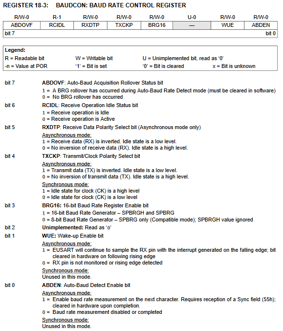
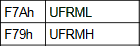
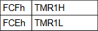
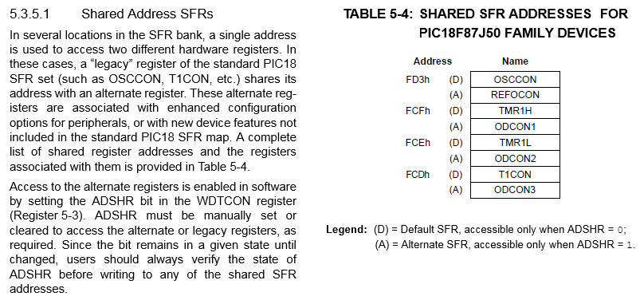
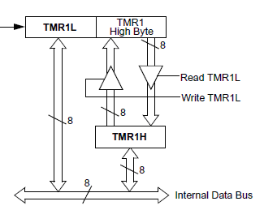

<h1>
{{title}}
</h1>

This document is intended for a user of the Concurrent Pascal implementation for MicroChip's PIC18<b><u><color="#FF0000">x</u></b> line of microcontrollers. Only PIC18 microcontrollers with the e<b><u><color="#FF0000">x</u></b>tended instruction set are supported. The extended instruction set adds support for the stack operations that allow re-entrant code. 

This document assumes the reader is already familiar with:

* Concurrent Pascal introductory material,
* Concurrent Pascal Language Reference,
* The MicroChip Datasheet for your PIC18x microcontroller. 

# Table of Contents
{:.no_toc}

* TOC
{:toc}

# Processor Directive

The microcontroller is specified by a compiler directive in the first line in the source file:

~~~
{$processor 'pic18f2520'}
~~~

This directive causes the compiler to reference two files included with the Concurrent Pascal distribution:

* bin/pic18x/include/pic18f2520.inc
* bin/processor_definition_files/pic18f2520.xml

The pic18f2520.inc file is a Concurrent Pascal include file which specifies ioreg type definitions, ioregs, interrupt variables and prototypes for special compiler-implemented procedures for that microprocessor.

The pic18f2520.xml file provides microcontroller specific information for the compiler such as SFR addresses.

# General Purpose Registers (GPRs) 

GPRs are used as RAM and locations are assigned by the compiler for variables, system types, stacks and internal kernel data structures.

## Non-Contiguous GPR Regions

A few PIC18s have non-contiguous GPR regions.  The current implementation of the compiler only utilizes the first GPR region.

## Dual-Port GPRs

Some PIC18x microcontrollers (e.g. USB controllers) have dual-ported GPRs.  This is not currently supported by the compiler but is something that will need to be addressed in the future.

# Special Function Registers (SFRs)

The microprocessor include file referenced by the $processor directive contain type definitions for the SFRs.  

For example, the datasheet for the PIC18F2525 describes the BAUDCON SFR bits as follows:

{:hspace="50"}

The pic18f2525.inc include file supplies the following type definition and ioreg declaration for BAUDCON:

~~~
type
   tBAUDCON =
      overlay
         packed record
            ABDOVF: uint1;
            RCIDL: uint1;
            RXDTP: uint1;
            TXCKP: uint1;
            BRG16: uint1;
            -: uint1;
            WUE: uint1;
            ABDEN: uint1
         end;
         packed record
            -: uint1;
            RCMT: uint1;
            RXCKP: uint1;
            SCKP: uint1;
            -: uint4
         end
      end;

ioreg
   BAUDCON: tBAUDCON at $FB8;
~~~

In addition to the fields defined by the datasheet, there are also occassionally some additional overlaid fields taken from Microchip documentation such as the RCMT, RXCKP and SCKP fields above.

## Combo SFR types

Often there are several adjacent SFRs for a hardware module that can be combined together into a single variable.  When a PIC contains multiple instances of the hardware module, multiple variables can be defined with a common type definition.  This type can be used to define a parameter to a subroutine which allows that subroutine to work with all instances of the hardware module.

An example would be the Analog to Digital Converter (ADC) in the PIC18F2520.  ADC: tADC combines five SFRs into a single variable:

* A/D Result High Register (ADRESH)
* A/D Result Low Register (ADRESL)
* A/D Control Register 0 (ADCON0)
* A/D Control Register 1 (ADCON1)
* A/D Control Register 2 (ADCON2)

~~~
type
   tADC =
      overlay
         packed record
            ADRES: uint16;
            -: uint2;
            CHS: uint4;
            GO_nDONE: uint1;
            ADON: uint1;
            -: uint2;
            VCFG: uint2;
            PCFG: uint4;
            ADFM: uint1;
            -: uint1;
            ACQT: uint3;
            ADCS: uint3
         end;
         packed record
            -: uint4;
            ADRES_12R: uint12;
            -: uint2;
            CHS3: uint1;
            CHS2: uint1;
            CHS1: uint1;
            CHS0: uint1;
            GO: uint1;
            -: uint3;
            VCFG1: uint1;
            VCFG0: uint1;
            PCFG3: uint1;
            PCFG2: uint1;
            PCFG1: uint1;
            PCFG0: uint1;
            -: uint2;
            ACQT2: uint1;
            ACQT1: uint1;
            ACQT0: uint1;
            ADCS2: uint1;
            ADCS1: uint1;
            ADCS0: uint1
         end;
         packed record
            ADRES_8L: uint8;
            ADRES_8R: uint8;
            -: uint6;
            DONE: uint1;
            -: uint17
         end;
         packed record
            ADRES_10L: uint10;
            -: uint12;
            nDONE: uint1;
            -: uint17
         end;
         packed record
            -: uint6;
            ADRES_10R: uint10;
            -: uint6;
            GO_DONE: uint1;
            -: uint17
         end;
         packed record
            ADRES_12L: uint12;
            -: uint28
         end;
         packed record
            ADRESH: uint8;
            ADRESL: uint8;
            -: uint24
         end
      end;

ioreg
   ADC: tADC at $FC0;
~~~

### Special ADC Result Fields

In addition to ADRES, ADRESH and ADRESL, the following special fields are defined for the analog to digital converter (ADC):

~~~
   ADRES_8L: uint8;
   ADRES_8R: uint8;
   ADRES_10L: uint10;
   ADRES_10R: uint10;
   ADRES_12L: uint12;
   ADRES_12R: uint12;
~~~

Each of these fields provides access to the exact bits of a particular configurable ADC result.  Depending on the microcontroller, ADCs can be configured to provide 8, 10 or 12 bit results either left or right justified.  Using one of these fields instead of the 16 bit ADRES field will allow the compiler to generate more compact code than if a 16-bit result field (ADRES) were used.

Note that the compiler does not automatically configure the ADC to load a specific result field, it assumes the programmer has done so before accessing that field.  Note also that only a few of the PICs have 12-bit ADCs - presence of a 12-bit ADRES field in the type definition does not guarantee that a particular PIC has a 12-bit ADC (see the datasheet!). 

<table style="border: 1px solid black; width: 100%; background: #212121;">
   <tr>
      <td style="padding: 25px;">
         
Help Wanted!

         
Identifying useful combinations of SFRs is a manual process requiring knowledge of the PIC hardware module.  It is recognized that far from all useful combo SFR types have been identified.  If you have experience with a particular hardware module, please submit suggestions for additional combo SFR types or special fields to 
         <a href="mailto:cpc@davidhawk.us?subject=pic18 combo sfr suggestion" style="color: #0090FF; text-decoration: underline;">cp@davidhawk.us</a>
         

      </td>
   </tr>
</table>

## Normal and Reversed Combo SFR Types

A perusal of the datasheets will reveal that Microchip's chip designers helpfully lay out some SFR groups as big-endian (MSB at lowest address) and others as little-endian (LSB at lowest address).  For example see these two SFR pairs from the PIC18F65J94 datasheet:

<table border="0" cellpadding="5">
    <tr>
        <td align="center">Normal</td>
        <td align="center">Reversed</td>
    </tr>
    <tr>
        <td></td>
        <td></td>
    </tr>
    <tr>
        <td align="center">big-endian</td>
        <td align="center">little-endian</td>
    </tr>
</table>

The compiler normally lays out multi-byte ordinal variables in big-endian format.  Little-endian SFR combinations are considered to be "Reversed byte order".

The compiler transparently handles both normal and reversed order SFR combinations.  All type definitions are laid out as  big-endian and the compiler generates the correct code to handle reversed byte order types.  Reversed combo SFR types are flagged in the processor definition xml file.

## Shared Address SFRs

Some PIC18 microcontrollers assign different SFRs to the same physical address and distinguish them by using the ADSHR bit in the WDTCON register.  The following explanation is from the PIC18F65J50 data sheet:
 

{:hspace="50"}

The Concurrent Pascal compiler treats ADSHR as a 13th address bit ($1---).  The addresses for the ioreg variables using the SFRs in Table 5-4 above are (TMR1 and ODCON happen to be combo-SFRs each containing three SFRs):

~~~
ioreg
   OSCCON: tOSCCON at $FD3;
   REFOCON: tREFOCON at $1FD3;
   TMR1: tTMR16 at $FCD;
   ODCON: tODCON at $1FCD;
~~~
 
Note that the “13th address bit” is set for all “Alternate” SFRs in Table 5-4.  The compiler will generate the necessary code to set ADSHR when an alternate SFR is accessed and then clear it immediately after.  The programmer should never need to set or clear the ADSHR bit directly.

## Atomicity of ioreg operations

The compiler ensures that **individual ioreg <u>field</u>** operations are **atomic**.  That means that a stray interrupt will not compromise a single ioreg field read or write operation.  Interrupts are turned off for any ioreg field operation that takes more than a single instruction - this includes SFR reads, masking, shifts and writes for the single field (plus any necessary setting and clearing of ADSHR for alternate address SFRs).

Although each ioreg field operation is atomic, it should be noted that **sequences** of field operations can be interrupted and are not guaranteed to be atomic unless placed within a single process or monitor and all of those fields are accessed exclusively by that process or monitor.

## Order of Multi-Byte SFR Reads or Writes

For some combo SFRs the order in which individual SFR reads or writes are done is important.  An example is the 16-bit timer in many PIC18 microcontrollers.  This timer can be configured to count clock cycles.  Special provisions are required to allow a consistent snapshot of its rapidly changing 16-bit value to be correctly read or written byte-wise by several instructions over the 8-bit bus.  The following block diagram is of TMR1 from the PIC18F2520 datasheet:

{:hspace="50"}

The blocks labeled “TMR1L” and “TMR1 High Byte” are 8-bit segments of the 16-bit timer.  The block labeled “TMR1H” is a latch provided by the chip designer to facilitate complete 16-bit transfers to or from the timer over the 8-bit data bus.  

To correctly read the entire 16-bit value TMR1L must be read first.  This simultaneously latches the current value in the upper byte of the timer into the TMR1H latch for later retrieval (by the time TMR1H is retrieved the upper byte of the actual timer may have changed).

Similarly, to correctly write a 16-bit value to TMR1 the upper byte is written into the TMR1H latch first and then when TMR1L is written both it and the latched value is simultaneously transferred to the actual timer counter.

For multi-byte SFR read operations the Concurrent Pascal compiler always emits code that reads the low byte first and writes the low byte last (this is true for both normal and reversed types).

# Process Priority Mapping

Process level 2 is mapped to the high priority interrupt level.  Processes and monitors running at priority level 2 run with interrupts off.

Process level 1 is mapped to the low priority interrupt level.  Processes and monitors running at priority level 1 run with the low priority interrupts off and high priority interrupts on.

Process and monitors running at levels 0 and below run with interrupts on.

# Interrupt Variables

The include files define a set of all possible interrupt variables for each microcontroller.  For example a microcontroller that implements TMR3 will have two interrupt variables, one for high priority (2) and one for low priority (1), similar to the following:

~~~
var
   TMR3I_prio2_interrupt:
      interrupt priority 2;
         function signaled: boolean;
            begin
               if PIR2.TMR3IF = 1 then
                  begin
                     result := true;
                     PIR2.TMR3IF := 0
                  end
            end;
      begin
         PIE2.TMR3IE := 1
      end;

   TMR3I_prio1_interrupt:
      interrupt priority 1;
         function signaled: boolean;
            begin
               if PIR2.TMR3IF = 1 then
                  begin
                     result := true;
                     PIR2.TMR3IF := 0
                  end
            end;
      begin
         IPR2.TMR3IP := 0;
         PIE2.TMR3IE := 1
      end;
~~~

The signaled functions test the interrupt flag and, if set, sets signaled to true and clears the interrupt flag.  This takes advantage of the fact that the result is initialized to false by the compiler and only needs to be set to true if the interrupt flag is set.  The initial statement clears the priority flag for low priority interrupts and enables the interrupt.

Only high priority (2) interrupt variables are defined for interrupts that do not have a priority bit defined.

<table style="border: none; background: #212121;">
  <tr>
    <td style="padding: 25px;" colspan="2">
      
Help Wanted!

      

        Most interrupts will be properly handled with the standard signaled code shown above, however there
        are some PIC18x hardware modules with quirky interrupts that don&#39;t work this way. For example, the USART TXI interrupt
        requires the enable and the flag bits to be set, and the necessary signaled code is as follows:
      

    </td>
  </tr>
  <tr>
    <td style="width:100px;"></td>
    <td>
      <table style="border:none">
        <tr>
          <td style="font-family: Monaco,&#39;Bitstream Vera Sans Mono&#39;,&#39;Lucida Console&#39;,Terminal,monospace; font-size: 14px; background-color: #FFF; padding: 15px;">
            function signaled: boolean; 
            &nbsp;&nbsp;&nbsp;begin 
            &nbsp;&nbsp;&nbsp;&nbsp;&nbsp;&nbsp;if PIE1.TXIE = 1 then 
            &nbsp;&nbsp;&nbsp;&nbsp;&nbsp;&nbsp;&nbsp;&nbsp;&nbsp;if PIR1.TXIF = 1 then 
            &nbsp;&nbsp;&nbsp;&nbsp;&nbsp;&nbsp;&nbsp;&nbsp;&nbsp;&nbsp;&nbsp;&nbsp;result := true 
            &nbsp;&nbsp;&nbsp;end; 
          </td>
        </tr>
      </table>
    </td>
  </tr>
  <tr>
    <td style="padding: 25px;" colspan="3">
      

        If you have experience with a particular hardware module that has a quirky interrupt that is not
        properly handled by the signaled function in the include file, please notify us at 
        <a href="mailto:cpc@davidhawk.us?subject=pic18%20interrupt%20quirk"
        style="color: #0090FF; text-decoration: underline;">cp@davidhawk.us</a>
      

    </td>
  </tr>
</table>

# EEPROM Support

Many PIC18x microcontrollers have internal EEPROM.  The compiler currently supports up to 256 bytes of internal EEPROM.  

# ROM Constants

The compiler gathers all ROM constants and constant strings into the first 64K of ROM memory.  Ensuring that the upper byte of the 24-bit program memory address for ROM constants is always clear slightly reduces the amount of code required to support ROM constants and interrupt overhead (TBLPTRU never needs to be set or saved).

# Integer Math Support

Multi-byte integer math code is generated with sufficiently sized operands to handle each integer math operation in the Concurrent Pascal program.  These operations cannot overflow.  The results are range checked and the global ErrorCode variable is set for out-of-range results.  Any out-of-range result is replaced with an arbitrary legal value and the program continues.

# Floating Point Support

The PIC18x Concurrent Pascal compiler supports 32-bit real variables.  The floating point routines were adapted from the PIC17 routines developed by Frank J. Testa for Microchip.  This library is described in Microchip’s [Application Note 575: IEEE 754 Compliant Floating Point Routines](http://ww1.microchip.com/downloads/en/AppNotes/00575.pdf) and [Application Note 660: Floating Point Math Functions](http://ww1.microchip.com/downloads/en/AppNotes/00660.pdf).  The PIC17 routines were modified to be reentrant by using the stack rather than absolute addresses.  Some minor changes were also necessary to account for differences between the PIC17 and PIC18 instruction sets.

All of the 32-bit math operations (add, subtract, multiply, etc.) from AN754 as well as the comparison functions from AN660 were incorporated into the Concurrent Pascal compiler.  AN660 also provides implementations of more advanced functions such a sin, cos, exp, etc.  These may be incorporated in the future.

The compiler implements two 32-bit floating point types:

## real

The real type should be used for most purposes within a Concurrent Pascal program.  Despite the title of Microchip’s application note, the binary format of a real variable is not the same as an IEEE 754 single, but is instead slightly altered for better performance on PIC microcontrollers.

## ieee_single

The ieee_single type is provided for use in transmitting binary values from the microcontroller to or from an external computer that implements IEEE floating point.  ieee_single and real variables are assignment compatible and an assignment will convert between the two formats.  Normally all calculations should be carried out with real variables and then the result assigned to an ieee_single variable for transmission in binary format to the external computer.

The following code fragment shows how to use an overlay variable to access the individual binary bytes of an ieee_single variable:

~~~
var
   r: real;
   o: overlay
         ieee: ieee_single;
         packed record
            b0: uint8;   // lsb of ieee_single
            b1: uint8;
            b2: uint8;
            b3: uint8    // msb of ieee_single
         end
      end;
begin
   calculate r;
   o.ieee := r;
   transmit  o.b3..o.b0  to external computer
end.
~~~

Note that real and ieee_single types are little-endian as implemented in the PIC18x Concurrent Pascal compiler.

## mod operator implementation

The PIC18x Concurrent Pascal compiler’s mod operator implementation gives a result with the same sign as the dividend.  This is the same behavior implemented in Delphi, but is different than ISO Pascal where the result is always positive. 

## round and trunc functions

In lieu of the standard Pascal round and trunc functions which return “standard integer” results, the PIC18x Concurrent Pascal compiler (which does not have a “standard integer”) provides these functions:

~~~
function round24 (r: real): int24;
function round32 (r: real): int32;
function trunc24 (r: real): int24;
function trunc32 (r: real): int32;
~~~

## Floating Point Error Handling

Floating Point errors are handled by setting the global ErrorCode.  The following errors are handled this way:

* Overflow (add, subtract, multiply, divide, integer to real conversion)
* Underflow (add, subtract, multiply, divide, integer to real conversion)
* Zero Divide (divide)
* Integer Overflow (real to integer conversion, round, trunc)

After setting ErrorCode, invalid floating point results are replaced by an arbitrary legal value and execution continues.

# String Support

Strings may contain a maximum of 255 characters.  The 0’th byte contains the current string length.  Actual bytes in the string are indexed 1..maxstrlen, where maxstrlen is the original string dimension from the type declaration.

## maxstrlen for undimensioned string parameters

The compiler will automatically add a hidden maxstrlen parameter for each undimensioned string parameter passed by reference.  Undimensioned strings passed as constants will not have a hidden maxstrlen parameter and the maxstrlen attribute will retrieve the actual strlen value instead.

~~~
procedure p (// the following parameters will have
             //   an additional hidden maxstrlen
             //   parameter passed:
                var sv: string;
                eeprom se: string;
             // the following parameters will report 
             //   the actual strlen for maxstrlen:
                s: string;
                rom sr: string
            );
~~~

# Special Procedures & Functions

## reset_TMRn_cycle (cycle_count: uint16)

These procedures, defined for each 16-bit timer in the microcontroller, can be used to give accurate instruction counter-driven process cycle times.

~~~
var
   p: process priority 2;
         begin
            // initialize TMRn
            await interrupt;
            cycle 
               …
               await interrupt;
               reset_TMRn_cycle (10000);
               …
            repeat
         end interrupt TMRnI_interrupt2;
~~~

In this example the TMRn interrupt will occur exactly every 10,000 instruction cycles assuming that the timer is initialized as follows:

•	the timer is configured to its full width (16 bits),
•	the clock source is set to internal instruction clock,
•	the pre-scaler is disabled (x1),
•	the timer is enabled.

With this configuration the 16-bit timers continuously count instruction cycles and generates an interrupt when the count reaches $FFFF.  The timer overflows to $0000 and keeps counting.  The reset_TMRn_cycle routine subtracts the cycle_count parameter (with a small adjustment ) from the current timer value to reset it below $FFFF again.  The next counter overflow and interrupt will occur exactly cycle_count instruction cycles after the previous overflow and interrupt.

Although the controlling TMRn interrupt cycle itself will be exactly 10,000 instructions in the above example, there will be some jitter for the instructions within the process cycle itself due to other parts of the Concurrent Pascal program running at higher priority or with interrupts off,.

Cycle times that are too low for a given application will result in frequent or infrequent “TMRn cycle count exceeded” error codes.  The error code is generated when the subtraction of cycle_count from the timer yields a result that is still above $0000.  In such cases process priorities will need to be juggled or a longer cycle time chosen.  It may be good practice to experimentally lower this cycle time until the error code begins to appear and then raise it to a higher value to give some margin.

The first await interrupt statement (the one before the cycle statement) in the above example is to prevent an extraneous “TMRn cycle count exceeded” error code at the first iteration due to the timer being in an unknown state due to a possibly lengthy system initialization time in a given application.  This pattern can result in two complete cycles of the timer (at 65,536 instruction cycles each) occurring after reset before the desired cycling time commences.

## ClearWatchdogTimer

Clears the watchdog timer. 
